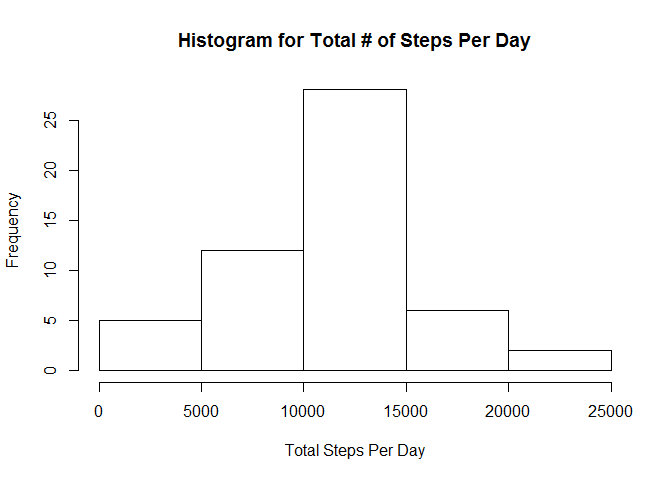
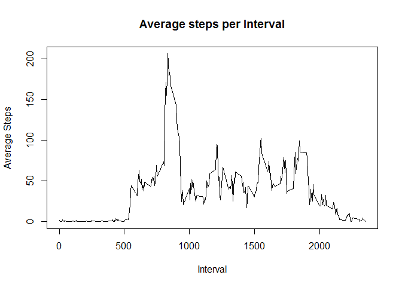
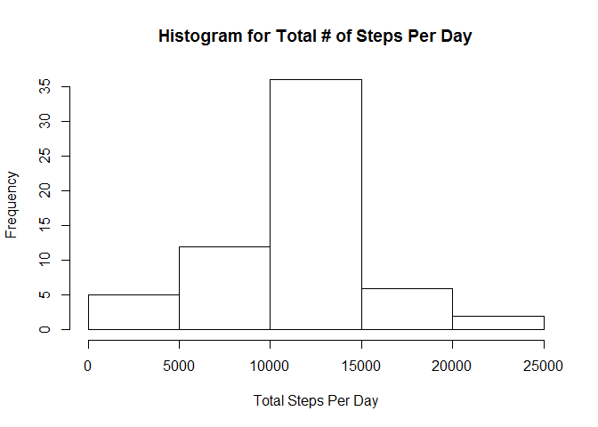
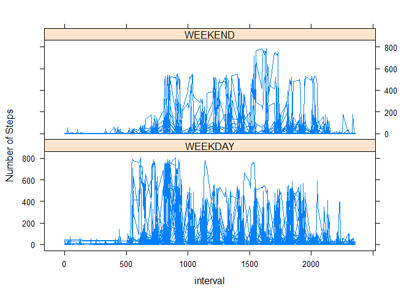

# Reproducible Research: Peer Assessment 1

#Introduction
It is now possible to collect a large amount of data about personal movement using activity monitoring devices such as a Fitbit, Nike Fuelband, or Jawbone Up. These type of devices are part of the "quantified self" movement - a group of enthusiasts who take measurements about themselves regularly to improve their health, to find patterns in their behavior, or because they are tech geeks. But these data remain under-utilized both because the raw data are hard to obtain and there is a lack of statistical methods and software for processing and interpreting the data.

This assignment makes use of data from a personal activity monitoring device. This device collects data at 5 minute intervals through out the day. The data consists of two months of data from an anonymous individual collected during the months of October and November, 2012 and include the number of steps taken in 5 minute intervals each day.

## Loading and preprocessing the data
- Load the activity data

```r
rawData <- read.csv("activity.csv")
```

- Load the necessary libraries (dplyr, lattice & timeDate)

```r
library(dplyr)
library(lattice)
library(timeDate)
```


## What is mean total number of steps taken per day?

- Ignore the missing values in the dataset

```r
dataNoNa <-filter(rawData, is.na(steps) == FALSE)
```

- Using the dplyr group_by functionality, group by date and calculate the total steps per dat

```r
by_date <- summarize(group_by(dataNoNa, date), TotalNumberOfSteps = sum(steps))
```

- With this, the mean total number of steps taken per day has been calculated. The below table shows the total number of steps taken per day, for the first 10 days

```r
head(by_date, 10)
```

```
## Source: local data frame [10 x 2]
## 
##          date TotalNumberOfSteps
##        (fctr)              (int)
## 1  2012-10-02                126
## 2  2012-10-03              11352
## 3  2012-10-04              12116
## 4  2012-10-05              13294
## 5  2012-10-06              15420
## 6  2012-10-07              11015
## 7  2012-10-09              12811
## 8  2012-10-10               9900
## 9  2012-10-11              10304
## 10 2012-10-12              17382
```

- A histogram is displayed, showing the total number of steps per day:

```r
hist(by_date$TotalNumberOfSteps, main = "Histogram for Total # of Steps Per Day", xlab = "Total Steps Per Day")
```



- The mean and median for of the total steps taken per day, is show below for the first 10 days:

```r
by_data_withMeanMedian <- summarize(group_by(dataNoNa, date), TotalSteps = sum(steps), MeanSteps = mean(steps), MedianSteps = median(steps))
head(by_data_withMeanMedian, 10)
```

```
## Source: local data frame [10 x 4]
## 
##          date TotalSteps MeanSteps MedianSteps
##        (fctr)      (int)     (dbl)       (dbl)
## 1  2012-10-02        126   0.43750           0
## 2  2012-10-03      11352  39.41667           0
## 3  2012-10-04      12116  42.06944           0
## 4  2012-10-05      13294  46.15972           0
## 5  2012-10-06      15420  53.54167           0
## 6  2012-10-07      11015  38.24653           0
## 7  2012-10-09      12811  44.48264           0
## 8  2012-10-10       9900  34.37500           0
## 9  2012-10-11      10304  35.77778           0
## 10 2012-10-12      17382  60.35417           0
```
## What is the average daily activity pattern?
- Calculating the average number of steps taken, averaged across all days for each interval:

```r
by_int <- summarize(group_by(dataNoNa, interval), mean = mean(steps))
```

- Plotting the average daily activity pattern

```r
plot(by_int$interval, by_int$mean, type = "l", main = "Average steps per Interval", xlab = "Interval", ylab = "Average Steps")
```



- The 5-minute interval that contains the maximum number of steps is 835th interval, with ~206 steps:

```r
head(arrange(by_int, desc(mean)), 1)
```

```
## Source: local data frame [1 x 2]
## 
##   interval     mean
##      (int)    (dbl)
## 1      835 206.1698
```

## Imputing missing values
- The total number of missing values in the dataset (where steps is null) is 2304 records.

```r
 count(filter(rawData, is.na(steps) == TRUE))
```

```
## Source: local data frame [1 x 1]
## 
##       n
##   (int)
## 1  2304
```

- A  new dataset is created, which  is equal to the original dataset but with the missing data filled in. The strategy for filling in all of the missing values in the dataset, is to replace the NA with the mean of that 5-minute interval.

```r
dataReplaceNA <- rawData
dataReplaceNA[is.na(rawData)] <- by_int$mean
```
- The first 10 results are shown below:

```r
head(dataReplaceNA,10)
```

```
##        steps       date interval
## 1  1.7169811 2012-10-01        0
## 2  0.3396226 2012-10-01        5
## 3  0.1320755 2012-10-01       10
## 4  0.1509434 2012-10-01       15
## 5  0.0754717 2012-10-01       20
## 6  2.0943396 2012-10-01       25
## 7  0.5283019 2012-10-01       30
## 8  0.8679245 2012-10-01       35
## 9  0.0000000 2012-10-01       40
## 10 1.4716981 2012-10-01       45
```

-Group by date and calculate the total steps:

```r
dataReplaceNA_byDate <- summarize(group_by(dataReplaceNA, date), sum = sum(steps))
hist(dataReplaceNA_byDate$sum, main = "Histogram for Total # of Steps Per Day", xlab = "Total Steps Per Day")
```



- To compare the dataset with NAs and the dataset without NAs, calculate and compare the means. The mean of the complete dataset (10766.19) is equal to the mean of the dataset without missing values, which is expected since the NAs were replaced with the mean

```r
mean(dataReplaceNA_byDate$sum)
```

```
## [1] 10766.19
```

```r
mean(by_date$TotalNumberOfSteps)
```

```
## [1] 10766.19
```
## Are there differences in activity patterns between weekdays and weekends?


- Using the dplyr and the timeDate package, a column is added to indicate if the dat3e is a WEEKDAY or WEEKEND

```r
dataReplaceNA<- mutate(dataReplaceNA, Weekday = isWeekday(dataReplaceNA$date))
dataReplaceNA$Weekday <- gsub(TRUE, "WEEKDAY",dataReplaceNA$Weekday)
dataReplaceNA$Weekday <- gsub(FALSE, "WEEKEND",dataReplaceNA$Weekday)
```

- The first 10 rows are shown below:

```r
head(dataReplaceNA, 10)
```

```
##        steps       date interval Weekday
## 1  1.7169811 2012-10-01        0 WEEKDAY
## 2  0.3396226 2012-10-01        5 WEEKDAY
## 3  0.1320755 2012-10-01       10 WEEKDAY
## 4  0.1509434 2012-10-01       15 WEEKDAY
## 5  0.0754717 2012-10-01       20 WEEKDAY
## 6  2.0943396 2012-10-01       25 WEEKDAY
## 7  0.5283019 2012-10-01       30 WEEKDAY
## 8  0.8679245 2012-10-01       35 WEEKDAY
## 9  0.0000000 2012-10-01       40 WEEKDAY
## 10 1.4716981 2012-10-01       45 WEEKDAY
```

- The activity is computed again, this time separating the data not only by interval but also by the Weekend factor.

```r
xyplot(steps ~  interval | Weekday, data = dataReplaceNA, layout = c(1,2), type ="l", ylab="Number of Steps")
```



- There is a difference between the weekday and weekend activity patterns. On Weekends, the activity is later in the day, compared to weekend on weekdays. 
